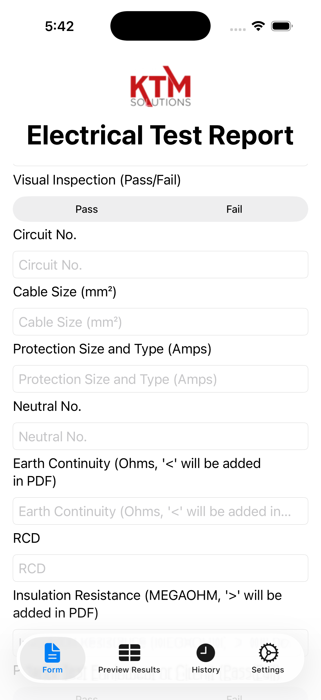
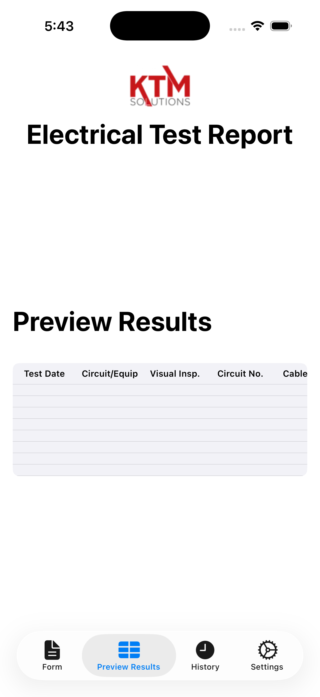
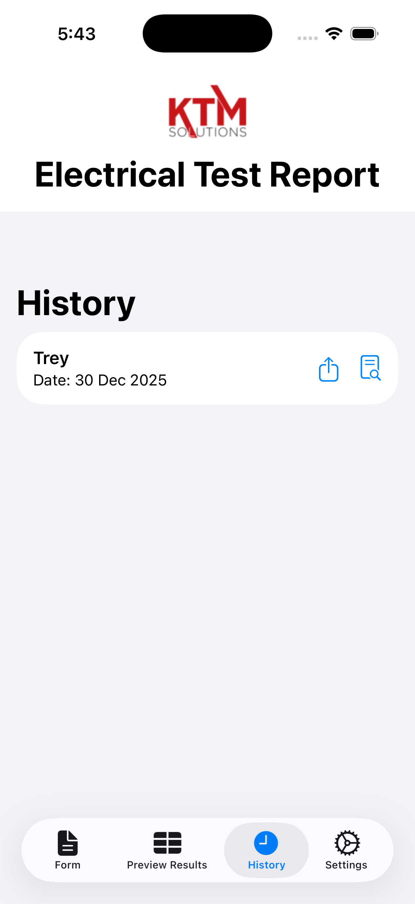
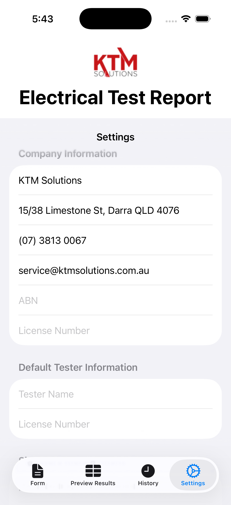

# KTM Solutions — Electrical Test Report App

A SwiftUI iOS app for creating, previewing, and exporting electrical test reports as a **documentation aid** for licensed electricians and electrical contractors working within Australian/New Zealand regulatory frameworks.

This application is designed to assist with record-keeping and reporting only. It does not certify compliance or replace official standards, legislation, or professional judgement.

---

## Features
- Easy entry of test results (up to 8 per report)
- PDF export with company branding and signature capture
- Optional in-app reference viewer for standards PDFs (search and bookmarking)
- Live preview of the test results table (as it will appear in the PDF)
- Edit and delete test results before export
- Settings for company and tester information
- Data backup/restore (JSON export/import)
- In-app help and FAQ

---

## Screenshots

| Form | Preview | PDF Export | Settings |
|---|---|---|---|
|  |  |  |  |

---

## About
The KTM Solutions Electrical Test Report App is a **productivity and documentation tool** intended to streamline the creation and storage of electrical test reports.

It assists licensed electrical workers in producing consistent documentation, but **all testing decisions, interpretations, and compliance responsibilities remain with the user**.

### Key Benefits
- **Time-saving:** Generate structured PDF test reports quickly
- **Consistency:** Built-in validation helps reduce missing or incomplete records
- **Reference convenience:** Optional in-app access to user-supplied standards PDFs
- **Professional output:** Branded PDF reports with company details and signatures
- **Portable records:** Export and restore saved reports using JSON backups

---

## Standards References (Important)

The app supports **optional in-app viewing** of standards PDFs for reference purposes only, such as:
- AS/NZS 3000 (Wiring Rules)
- AS/NZS 3017 (Verification / Testing)
- AS/NZS 3008 (Selection of Cables)

**Standards documents are not supplied with this application.**

Users must obtain their own **legally licensed copies** of all standards from the official publisher (e.g. **Standards Australia / SAI Global** or authorised distributors).

KTM Solutions:
- Does **not** publish, own, or maintain any standards
- Does **not** verify the accuracy, currency, or applicability of standards content
- Does **not** interpret or replace official standards documentation

---

## Requirements
- Xcode 15+ (recommended)
- iOS 15+ (recommended)
- SwiftUI

---

## Setup
1. Clone this repository.
2. Open the project in Xcode.
3. (Optional) Add your **own licensed copies** of standards PDFs (e.g. `AS3000.pdf`, `AS3017.pdf`, `AS3008.pdf`) to the app bundle:
   - Drag PDFs into Xcode
   - Ensure **Target Membership** is enabled
4. Build and run on a simulator or device.

---

## Usage
- Enter customer, site, and test details.
- Add up to 8 test results per report.
- Use the Preview tab to confirm layout before export.
- Export PDF reports for record-keeping and job documentation.
- Use the Standards section **only as a reference viewer** if PDFs are supplied.

---

## Backup / Restore
- **Export:** Settings → Export/Backup → Export All Reports (JSON)
- **Import:** Settings → Export/Backup → Import/Restore Backup (JSON)

---

## Support
For KTM Solutions support:
- Email: `service@ktmsolutions.com.au`
- Phone: `(07) 3813 0067`

---

## Roadmap (Optional)
Planned improvements may include:
- Customisable PDF layouts
- Additional test templates
- Multiple company profiles
- Optional cloud sync

---

## Contributing
This repository is intended for KTM Solutions internal development and evaluation.

If contributions are enabled:
1. Fork the repository
2. Create a feature branch (`feature/your-change`)
3. Commit with clear messages
4. Submit a Pull Request

Please do not commit:
- `DerivedData/`
- `*.xcuserdata/`
- `build/`
- Copyrighted standards PDFs

---

## License
**Proprietary / Internal Use**

Copyright © KTM Solutions. All rights reserved.

This software is provided for internal evaluation and operational use only.  
No rights are granted to copy, modify, distribute, sublicense, or sell this software without explicit written permission from KTM Solutions.

---

## Disclaimer (Liability & Compliance)

This application is a **documentation and record-keeping tool only**.

- KTM Solutions accepts **no responsibility or liability** for electrical work performed, test results recorded, or compliance decisions made using this app.
- All electrical testing, verification, and compliance obligations remain the **sole responsibility of the licensed electrician or electrical contractor** performing the work.
- Australian/New Zealand Standards are maintained by **Standards Australia / SAI Global** and may change over time. Users are responsible for ensuring they reference the **current legally applicable versions**.

Nothing in this application constitutes:
- Legal advice
- Regulatory approval
- Certification of compliance
- Professional or engineering advice
